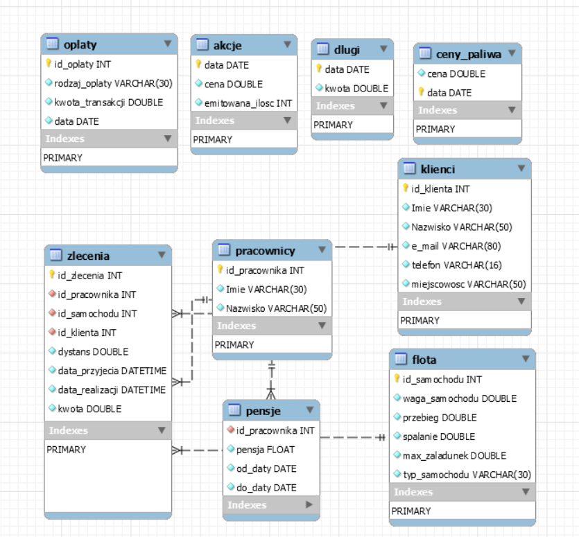

#Opis bazy danych
Baza danych składa się z dziewięciu encji -- tablic zawierających informacje:

* o pracownikach firmy i ich pensjach,
* o flocie firmy,
* o klientach i wykonywanych dla nich zleceniach,
* o cenach paliwa w danym dniu,
* o wartościach akcji firmy,
* o długach i opłatach.


## Schemat bazy

Schemat bazy danych został przedstawiony na wykresie 1.




##O firmie

Nasza firma spedycyjna jest spora, choć nie należałaby do czołówki największych firm w Polsce. Flota składa się z 75 pojazdów: 59 samochodów ciężarowych oraz 16 samochodów dostawczych.
Liczba pracowników zmienia się w każdym roku. Wzrasta wraz z upływem czasu, choć losowo występują również zwolnienia. Ilość pracowników jest zawsze większa niż ilość pojazdów i waha się pomiędzy 81 a 122.
Ilość nowych zleceń jako kwantyzacja rozkładu lognormalnego zazwyczaj mieściła się w przedziale 10-30. Zlecenia na terenie Polski (dystans mniejszy niż 800km) realizowano samochodami dostawczymi, natomiast zagraniczne samochodami ciężarowymi. Samochód jak i pracownik realizujący wybierani byli losowo z puli wolnych w tym czasie samochodów/pracowników. 

##Rozpatrywany okres czasu

Dane zostały wygenerowane dla okresu od 1 stycznia 2010 do 1 kwietnia 2020. Daty te występowały we wszystkich tabelach, można więc przyjąć że początkiem działalności rynkowej jak i dniem pierwszej emisji akcji spółki (IPO) był dzień 01.01.2010. Ceny paliwa i akcji zmieniały się codziennie.


##Generowanie danych
Skrypt do wypełnienia bazy danych został napisany w języku Python. Do wygenerowania losowych zmiennych kategorycznych (takich jak imiona, nazwiska i adresy) wykorzystana została biblioteka Faker (wersja polskojęzyczna), zaś do wygenerowania danych liczbowych wykorzystana została biblioteka random. Baza po każdym generowaniu wygląda tak samo, ponieważ przy wypełnianiu danych korzystamy z tego samego zestawu liczb losowych. 


##Instrukcja do wygenerowania bazy
Aby móc wygenerować bazę danych oraz być w stanie odtworzyć rezultaty naszej pracy, należy pobrać repozytorium z kodami 
dostępnymi na stronie github. Przykładowo można to zrobić używając polecenia:
    
    git clone https://github.com/lukaszlaszczuk/projekt-bazy-danych.git
    
W celu wygenerowania bazy, najpierw należy upewnić się, czy zainstalowane są wszystkie potrzebne biblioteki języka Python. Lista niezbędnych bibliotek (wraz z ich wersjami) znajduje się w pliku requirements.txt. Możemy je zainstalować w łatwy sposób przy użyciu systemu pip, za pomocą komendy:


    pip install -r requirements.txt


Jeżeli wszystkie potrzebne biblioteki są już zainstalowane, to możemy wygenerować raport wynikowy.
W raporcie znajduje się kod tworzący schemat bazy oraz wykonujący skryptowe wypełnianie tabel bazy danych.
Program potrzebuje kilku informacji, które musimy podać, edytując plik `projekt-bazy-danych/project/database-info/database_credentials.xlsx`.
Informacje te to:

* nazwa hostu;
* nazwa użytkownika;
* hasło do bazy danych (w przypadku braku zostawiamy puste).

Po uzupełnieniu odpowiednich informacji możemy wygenerować raport wynikowy
używając następującego polecenia w folderze `projekt-bazy-danych/project/raport`:
 
    stitch raport.md -o raport_wynikowy.pdf
    
Polecenie to wygeneruje końcowy raport z analizą.
 
#Analiza danych

```{python, include=False, echo=False}
import mysql.connector
import os
import re
import subprocess
import sys

import numpy as np
import pandas as pd
import matplotlib.pyplot as plt
import matplotlib.pylab as pylab

from datetime import datetime, timedelta
from scipy.optimize import fsolve
from scipy.stats import norm
from sklearn.preprocessing import scale


os.chdir('..')
from util.functions_util import *
from util.MySQLConnector import MySQLConnector
os.chdir('raport')

connection = MySQLConnector.connect('localhost', 'root', database='spedycja')
cursor = MySQLConnector.get_cursor(connection)

start_date = datetime(2010, 1, 1)
end_date = datetime(2020, 4, 1)

params = {'legend.fontsize': 'x-large',
          'figure.figsize': (13.25, 6.5),
         'axes.labelsize': 'x-large',
         'axes.titlesize':'x-large',
         'xtick.labelsize':'x-large',
         'ytick.labelsize':'x-large'}
pylab.rcParams.update(params)
os.chdir('..')
sys.stdout = open(os.devnull, "w")
sys.stderr = open(os.devnull, "w")
sys.stdout = sys.__stdout__
sys.stderr = sys.__stderr__
db_info = pd.read_excel(os.path.join('database-info', 'database_credentials.xlsx'))
host, user, password = db_info.iloc[0, :].fillna('')
subprocess.run(['python', os.path.join('generate_schema.py'), host, user, password])
subprocess.run(['python', os.path.join('db_populate.py'), host, user, password])
```

## 1. Liczba oczekujących zleceń w czasie

W naszej firmie liczba kierowców była zawsze większa od liczby dostępnych
samochodów. Zdarzało się, że wszystkie samochody były aktualnie w trasie. W takich przypadkach
zlecenie musiało poczekać na podjęcie realizacji. Zwizualizujemy jak ta liczba zmieniała się w czasie. 
Przygotowaliśmy dwa wykresy:

* Dzienna liczba oczekujących zleceń;
* Pierwszy wykres był dość niewyraźny, więc zagregowaliśmy tygodniowo  liczbę oczekujących zleceń i policzyliśmy średnią w każdym z tygodni 

```{python, include=False, echo=False}
cursor.execute('SELECT data_przyjecia, data_realizacji from zlecenia')
result = cursor.fetchall()
daty = pd.DataFrame(result, columns=['Data przyjęcia', 'Data realizacji'])
n_oczekujace = get_liczba_oczekujacych_zlecen(start_date, end_date, daty)
n_oczekujace.plot(kind='scatter', x='Data', y='Ilość oczekujących')
plt.title('Dzienna liczba oczekujących zleceń', fontsize=28)
plt.ylabel('Liczba oczekujących zleceń', fontsize=20)
plt.xlabel('Czas', fontsize=20)
plt.show()
```
Dane zaprezentowane w ten sposób nie są czytelne, dlatego zagregowaliśmy tygodniowo liczbę oczekujących zleceń
i wyciągnęliśmy dla każdego z nich średnią. 


```{python, echo=False}
dates = [i[0] for i in n_oczekujace.resample('W-Mon', on='Data')['Data']]
avg_oczekujacych_week = np.array([i[1].mean() for i in n_oczekujace.resample('W-Mon', on='Data')['Ilość oczekujących']])
plt.plot(dates, avg_oczekujacych_week)
plt.title('Agregacja tygodniowa liczby oczekujących zleceń', fontsize=28)
plt.ylabel('Liczba oczekujących zleceń', fontsize=20)
plt.xlabel('Czas', fontsize=20)
plt.show()
``` 
Aby w lepszy sposób zwizualizować rozkład zaobserwowanej realizacji wektora losowego
liczby oczekujących zleceń, pokażemy wykres dystrybuanty empirycznej tej zmiennej. 
```{python, echo=False}
ser = pd.Series(n_oczekujace['Ilość oczekujących']).sort_values()
ser[len(ser)] = ser.iloc[-1]
cum_dist = np.linspace(0.,1.,len(ser))
ser_cdf = pd.Series(cum_dist, index=ser)
ser_cdf.plot(drawstyle='steps')
plt.xlim(0, 70)
plt.title('Dystrybuanta empiryczna rozkładu liczby oczekujących zleceń', fontsize=28)
plt.ylabel('$F(x)$', fontsize=20)
plt.xlabel('Liczba oczekujących zleceń', fontsize=20)
plt.show()
```
Jak widać z wykresu dystrybuanty empirycznej przez ponad $60\%$ dni
nie mieliśmy zleceń ozekujących do realizacji, a w około $80\%$ przypadków zmienna losowa
 przyjmowała wartości mniejsze niż 10. Rozkład tej zmiennej jest prawostronnie skośny

\pagebreak

##2.  Wykres liczby zmieniających się pracowników

W naszej bazie danych założyliśmy, że lista pracowników zmienia się rocznie (na początku każdego roku zwalniamy lub zatrudniamy nowych pracowników). Przygotowaliśmy więc:

* Wykres zatrudnionych pracowników na dany rok;
* Wykres liczby pracowników, którzy są w trasie w danym dniu.

```{python, include=False, echo=False}
cursor.execute('SELECT od_daty from pensje')
result = cursor.fetchall()
daty = pd.DataFrame(result, columns=['Data rozpoczęcia kontraktu'])
date = [i[0] for i in daty.groupby('Data rozpoczęcia kontraktu')]
ilosc_pracownikow = [i[1].shape[0] for i in daty.groupby('Data rozpoczęcia kontraktu')]
#plt.bar(date, ilosc_pracownikow)
plt.plot(date, ilosc_pracownikow)
plt.title('Liczba pracowników w danym roku', fontsize=28)
plt.ylabel('Liczba pracowników', fontsize=20)
plt.xlabel('Czas', fontsize=20)
plt.ylim(0, 130)
plt.show()
```

Z wykresu możemy zauważyć rosnący trend zatrudnionych pracowników. Nasza firma się rozwija!

```{python, include=False, echo=False}
cursor.execute('SELECT dystans, data_realizacji from zlecenia')
result = cursor.fetchall()
df = pd.DataFrame(result, columns=['Dystans', 'Data rozpoczęcia realizacji'])
df['Data zakończenia realizacji'] = df.apply(lambda x: x[1]+timedelta(days=2) if x[0]<800 else x[1]+timedelta(days=5), axis=1)
date_range = pd.date_range(start_date, end_date)
liczba_zajetych = [df[(df['Data rozpoczęcia realizacji'] <= date) & (df['Data zakończenia realizacji'] > date)].shape[0] for date in date_range]

plt.plot(date_range, liczba_zajetych)
plt.title('Liczba kursujących kierowców w czasie', fontsize=28)
plt.ylabel('Liczba kierowców', fontsize=20)
plt.xlabel('Czas', fontsize=20)
plt.ylim(0, 130)
plt.show()
```
 
Na wykresie możemy zaobserwować pewną okresowość liczby kursujących. Przez zdecydowaną
większość czasu więcej niż 40 kierowców było w trasie.

##3. Bilans finansowy firmy - czy jest w stanie się utrzymać?

 W tej części postaramy się sprawdzić, jakie jest prawdopodobieństwo zbankrutowania firmy spedycyjnej.
 Na podstawie akcji oraz długów firmy sprawdzimy przy pomocy modelu KMV prawdopodobieństwo bankructwa (Default Probability)
 dla rocznego horyzontu czasowego, przy stopie wolnej od ryzyka równej $0,5\%$. Aby móc skorzystać z modelu KMV
 będziemy potrzebować: całkowitej wartości akcji, całkowitej wartości długu oraz dziennych logarytmicznych stóp zwrotu
 z akcji. Zaprezentujemy te zmienne na wykresach.
 
```{python, include=False, echo=False}
def d1(V_t, L, r, sigma_v, horizon):
    return (np.log(V_t/L) + (r+0.5*sigma_v**2)*horizon) / (sigma_v*np.sqrt(horizon))

def d2(V_t, L, r, sigma_v, horizon):
    return (np.log(V_t/L) + (r-0.5*sigma_v**2)*horizon) / (sigma_v*np.sqrt(horizon))

def equations(params, add_args):
    V_t, sigma_v = params
    L, r, horizon, E_t, sigma_e = add_args
    d1_v = d1(V_t, L, r, sigma_v, horizon)
    d2_v = d2(V_t, L, r, sigma_v, horizon)
    return (V_t*norm.cdf(d1_v) - \
       L*np.exp(-r*horizon)*norm.cdf(d2_v) - \
       E_t,
      E_t*sigma_e - norm.cdf(d1_v)*sigma_v*V_t)

trading_days_year = 252
r = 0.005/trading_days_year
years = 10 
cursor.execute('select * from akcje;')
result = cursor.fetchall()
akcje = pd.DataFrame(result, columns=['data', 'cena', 'ilosc_akcji'])
akcje_log_return = np.log(akcje['cena']).diff().dropna().reset_index(drop=True)
std_akcje_log_return = np.std(akcje_log_return)
cursor.execute('select * from dlugi;')
result = cursor.fetchall()
dlugi = pd.DataFrame(result, columns=['data', 'wartosc'])

plt.plot(akcje['data'], akcje['cena'])
plt.title('Cena akcji', fontsize=28)
plt.ylabel('Cena', fontsize=20)
plt.xlabel('Czas', fontsize=20)
plt.show()
``` 

```{python, include=False, echo=False}
plt.plot(akcje['data'][1:], akcje_log_return)
plt.title('Dzienne logarytmiczne stopy zwrotu', fontsize=28)
plt.ylabel('Log stopy zwrotu', fontsize=20)
plt.xlabel('Czas', fontsize=20)
plt.show()
```

**Obserwacja**: Akcje były dość stabilne, w 2020 widzimy duży wzrost zmienności logarytmicznych stóp zwrotu.
 Spowodowane jest to kryzysem wywołanym przez koronawirus.

```{python, include=False, echo=False}
fig, (ax1) = plt.subplots(1, 1)
ax1.plot(akcje['data'], akcje['cena']*akcje['ilosc_akcji'], label='Aktywa')
ax1.plot(akcje['data'], dlugi['wartosc'], label='Długi')
ax1.set_title('Wartość akcji vs wartość długów', fontsize=28)
ax1.set_ylabel('Wartość (zł)', fontsize=20)
ax1.set_xlabel('Czas', fontsize=20)
plt.legend()
plt.show()
```

Wartość akcji jest przez cały okres większa od wartości długów.

```{python, include=False, echo=False}
#import warnings
#warnings.filterwarnings("ignore")
result = []
for i in range(trading_days_year, years*trading_days_year-2):
    aktywa = akcje['cena'][i]*akcje['ilosc_akcji'][i]
    dlugi_wartosc = dlugi['wartosc'][i]
    std_rocz_log_stopy = np.std(akcje_log_return[i-trading_days_year:i])
    V_t, sigma_v = fsolve(equations,
                                    (aktywa, std_rocz_log_stopy),
                                    args=[dlugi_wartosc, r, trading_days_year,
                                          aktywa, std_rocz_log_stopy])
    d2_ret = d2(V_t, dlugi_wartosc, r, sigma_v, trading_days_year)
    result.append(1 - norm.cdf(d2_ret))
result = pd.Series(np.array(result))
```

```{python, include=False, echo=False}
plt.plot(akcje['data'][312:], result)
plt.title('Prawdopodobieństwo bankructwa w czasie', fontsize=28)
plt.ylabel('DP', fontsize=20)
plt.xlabel('Czas', fontsize=20)
plt.show()
```

**Obserwacja:** Prawdopodobieństwo bankructwa w modelu KMV jest tożsama z zerem dla zdecydowanej większości
 analizowanego okresu. Widzimy wzrost tego prawdopodobieństwa na przełomie lat 2019-2020 (lecz dalej jest to 
 prawdopodobieństwo rzędu $10^{-9}$.

## 4. Lista osób najdłużej czekających na zlecenie

* Pokazujemy imię i nazwisko oraz sumaryczny czas (dla wszystkich złożonych zleceń) oczekiwania na realizację zlecenia
 dla 10 klientów, którzy sumarycznie czekali na zlecenia najdłużej.

```{python, include=False, echo=False}
cursor.execute('''
select id_k, data_przyjecia, data_realizacji, Imie, Nazwisko from(
(SELECT id_klienta as id_z, data_przyjecia, data_realizacji from zlecenia) as t1
inner join
(SELECT id_klienta as id_k, Imie, Nazwisko from klienci) as t2 on t1.id_z = t2.id_k)
WHERE data_przyjecia != data_realizacji;
''')

result = cursor.fetchall()
df = pd.DataFrame(result, columns=["id_klienta", "data_przyjecia", "data_realizacji", "Imie", "Nazwisko"])
df['Imie i nazwisko'] = df['Imie'] + ' ' + df['Nazwisko']
df['Czas_oczekiwania'] = df['data_realizacji'] - df['data_przyjecia']
df = df.drop(['Imie', 'Nazwisko', 'data_przyjecia', 'data_realizacji'], axis=1)
df_map = df.drop_duplicates('id_klienta').iloc[:, :-1].reset_index(drop=True)
czas_oczekiwania = df.groupby('id_klienta')['Czas_oczekiwania'].sum()
top_czas_oczekiwania = czas_oczekiwania.sort_values(ascending=False).reset_index().head(10)
najdluzej_czekajacy = pd.merge(top_czas_oczekiwania, df_map, on='id_klienta').iloc[:, 1:]
```

```{python, include=False, echo=True}
najdluzej_czekajacy.iloc[:, ::-1]
```

**Wniosek:** Przepraszamy Panią Dagmarę.

## 5. Dodatkowe analizy:

* Którzy pracownicy realizowali zlecenia, które przynosiły najwięcej zysku?;
* Czy pensje tych pracwników były najwyższe?;
* Które samochody miały największy przebieg;
* Roczne zestawienie kosztów paliwa;
* Klienci, na których zarobiliśmy najwięcej.

**1. Lista pracowników którzy średnio generowali największy zysk**

```{python, include=False, echo=False}
cursor.execute(
    '''
    select q1.id_pracownika, sredni_zysk, Imie, Nazwisko from 
    (select id_pracownika,avg(kwota) as sredni_zysk from zlecenia group by id_pracownika order by avg(kwota) desc limit 10) as q1
    inner join
    (select * from pracownicy) as q2 on q1.id_pracownika=q2.id_pracownika;
    ''')
result = cursor.fetchall()
df = pd.DataFrame(result, columns=['id', 'sredni zysk', 'Imie', 'Nazwisko'])
```

```{python, include=False, echo=True}
df
```

\pagebreak

**2. Czy Ci pracownicy zarabiali najwięcej?**

```{python, include=False, echo=False}
cursor.execute(
    '''
    select q1.id_pracownika, pensja, Imie, Nazwisko from 
    (select distinct id_pracownika, pensja from spedycja.pensje) as q1
    inner join
    (select * from pracownicy) as q2 on q1.id_pracownika=q2.id_pracownika
    order by pensja desc;
    ''')

result = cursor.fetchall()
najlepiej_zarabiajacy = pd.DataFrame(result, columns=['id', 'Pensja', 'Imie', 'Nazwisko'])
podsumowanie = pd.merge(najlepiej_zarabiajacy[najlepiej_zarabiajacy['id'].isin(df['id'])], df, on='id')
podsumowanie['miejsce_w_pensjach'] = najlepiej_zarabiajacy[najlepiej_zarabiajacy['id'].isin(df['id'])].index.values
podsumowanie = podsumowanie[['miejsce_w_pensjach', 'sredni zysk',
              'Pensja', 'Imie_x', 'Nazwisko_x']].sort_values('sredni zysk', ascending=False).reset_index(drop=True)
```

```{python, include=False, echo=True}
podsumowanie
```

Sprawdzimy jeszcze jak najlepsi pracownicy wyglądają na tle innych pracowników.
\newline

```{python, include=False, echo=False}
cursor.execute(
    '''
    select q1.id_pracownika, sredni_zysk, pensja, Imie, Nazwisko from 
    (select id_pracownika,avg(kwota) as sredni_zysk from zlecenia group by id_pracownika order by avg(kwota) desc) as q1
    inner join
    (select * from pracownicy) as q2 on q1.id_pracownika=q2.id_pracownika
    inner join
    (select distinct id_pracownika, pensja from spedycja.pensje) as q3 on q1.id_pracownika=q3.id_pracownika;
    ''')
result = cursor.fetchall()
df_wszyscy = pd.DataFrame(result, columns=['id', 'sredni zysk', 'pensja', 'Imie', 'Nazwisko'])
podsumowanie_inni = pd.merge(df_wszyscy[~df_wszyscy['id'].isin(df['id'])], df, on='id', how='left')
```

```{python, include=False, echo=False}
plt.scatter(podsumowanie['sredni zysk'], podsumowanie['Pensja'], label="Najlepsi pracownicy")
plt.scatter(podsumowanie_inni['sredni zysk_x'], podsumowanie_inni['pensja'], label="Inni pracownicy")

plt.title('Pensja vs generowany średni zysk', fontsize=28)
plt.ylabel('Średni zysk', fontsize=20)
plt.xlabel('Pensja', fontsize=20)
plt.legend()
plt.show()
```

**Wniosek**: "Najlepsi pracownicy" wcale nie mają największych pensji. Nie widzimy zauważalnie pozytywnej korelacji pomiędzy zyskiem a pensją.

\pagebreak

**3. Które samochody miały największy przebieg**

Założyliśmy, że w tabeli flota mamy początkowy przebieg auta w czasie zakupu (możemy kupować używane samochody). Całkowity przebieg jest sumą początkowego przebiegu i sumy dystansów ze tabeli zlecenia.

```{python, include=False, echo=False}
cursor.execute(
    '''
    select id_samochodu,sum(suma_przebiegow) from (select przebieg as suma_przebiegow, id_samochodu as id_samochodu from flota
    union
    select sum(dystans), id_samochodu from zlecenia group by id_samochodu) as eksploatacja group by id_samochodu order by sum(suma_przebiegow) desc limit 0,10;
    ''')

result = cursor.fetchall()
najbardziej_eksploatowane = pd.DataFrame(result, columns=['id', 'całkowity przebieg'])
```

```{python, include=False, echo=True}
najbardziej_eksploatowane
```

**4.Roczne zestawienie kosztów za paliwo**

```{python, include=False, echo=False}
cursor.execute(
    '''
    SELECT YEAR(zlecenia_ze_spalaniem.data_realizacji) as rok, SUM(dystans/100*cena*spalanie) as 'calkowita koszty paliwa'
    FROM (SELECT zlecenia.id_samochodu as id_samochodu,
           dystans, data_realizacji, spalanie FROM zlecenia
    INNER JOIN
    (SELECT spalanie, id_samochodu FROM flota) flota
    ON zlecenia.id_samochodu = flota.id_samochodu) zlecenia_ze_spalaniem
    INNER JOIN ceny_paliwa ON ceny_paliwa.data=DATE(zlecenia_ze_spalaniem.data_realizacji)
    group by rok;
    ''')
result = cursor.fetchall()
df = pd.DataFrame(result, columns=['Rok', 'Koszt'])

cursor.execute(
    '''
    select * from ceny_paliwa;
    ''')
result = cursor.fetchall()
paliwo = pd.DataFrame(result, columns=['cena', 'Data'])
```

```{python, include=False, echo=False}
fig, (ax1, ax2) = plt.subplots(2, 1)
ax1.plot(df['Rok'][:-1], df['Koszt'][:-1], label='Koszty za paliwo')
ax2.plot(paliwo['Data'][:-20], paliwo['cena'][:-20], label='Ceny paliwa')
fig.suptitle('Koszty paliwa vs ceny paliwa', fontsize=28)
ax1.set_ylabel('Wartość (zł)', fontsize=20)
#ax2.set_title('Ceny paliwa', fontsize=24)
ax2.set_ylabel('Wartość (zł)', fontsize=20)
ax2.set_xlabel('Czas', fontsize=20)
plt.show()
```

**Wniosek:** Widzimy zależność pomiędzy cenami paliwa a kosztami.

\pagebreak 

**5. Lista klientów, na których zarobiliśmy najwięcej**

```{python, include=False, echo=False}
cursor.execute(
    '''
    SELECT klienci.id_klienta as Id_klienta,
           Imie, Nazwisko, e_mail, telefon, miejscowosc,
           Zarobek_na_kliencie
    FROM klienci
    INNER JOIN
    (SELECT id_klienta, sum(kwota) as Zarobek_na_kliencie
    FROM zlecenia
    GROUP BY id_klienta) smallest_and_greatest
    ON smallest_and_greatest.id_klienta = klienci.id_klienta
    ORDER BY Zarobek_na_kliencie desc
    LIMIT 10;
    ''')
result = cursor.fetchall()
najlepsi_klienci = pd.DataFrame(result, columns=['Id', "Imię", "Nazwisko", "mail",
                                           "telefon", "Miejscowość", "Zysk"])
```

```{python, include=False, echo=True}
najlepsi_klienci.iloc[:, :3]
```


```{python, include=False, echo=False}
plt.bar(najlepsi_klienci['Nazwisko'], najlepsi_klienci['Zysk'])


plt.title('Najbardziej zyskowni klienci', fontsize=28)
plt.ylabel('Suma zysku ze zleceń klienta', fontsize=20)
plt.xlabel('', fontsize=20)
plt.show()
```


#Podsumowanie

* W projekcie zasymulowaliśmy bazę danych firmy spedycyjnej.
* Wszystkie skrypty integrujące serwer bazy danych były napisane w języku Python.
 Jego uniwersalność pozwoliła nam na połączenie z językiem SQL w celu wygenerowania schematu bazy,
 stworzenie skryptu wypełniającego bazę odpowiednimi danymi, przeprowadzenie analizy danych oraz
 automatyczne wygenerowanie raportu, który wykonuje wszystkie poprzednie zadania przy
 użyciu jednego polecenia z linii komend;
* Według nas najtrudniejszym zadaniem było skryptowe wypełnienie bazy i na tę część poświęciliśmy najwięcej
czasu. Niebanalne było również stworzenie struktury projektu w taki sposób,
aby możliwe było wykonanie wszystkich poleceń przy użyciu jednego polecenia
z linii komend.  


```{python, include=False, echo=False}
MySQLConnector.close_connection(connection)
```
